<table>
<tr>
<td valign="top"></td>
<td valign="top"></td>
</tr>
</table>

## Redha Khelef

**M.Sc. Student · Cloud Scheduling Research · Indie Dev**

 

<!-- animated contribution graph, refreshed daily by the workflow -->

